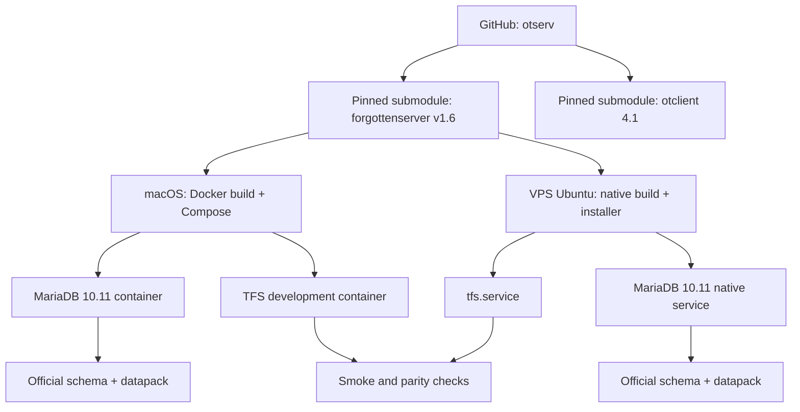

# Bootstrap Open Tibia Server Design

**Spec**: `.specs/features/bootstrap-open-tibia-server/spec.md`
**Status**: Approved

---

## Approach Selection

Three approaches were considered:

| Approach | Development | VPS | Trade-off | Decision |
| --- | --- | --- | --- | --- |
| Hybrid | Docker Compose on macOS | Native TFS + MariaDB + `systemd` | Two packaging paths require explicit parity tests | **Selected by user** |
| Docker everywhere | Docker Compose | Docker Compose | Simplest parity, but adds an unwanted container layer in production | Rejected |
| Native everywhere | Native macOS dependencies | Native Ubuntu services | Removes Docker but pollutes the development host and diverges by OS | Rejected |

The repository architecture is also confirmed: one public orchestration repository, `RonaldoAntonucci/otserv`, plus true public forks `RonaldoAntonucci/forgottenserver` and `RonaldoAntonucci/otclient`.

---

## Architecture Overview

The same pinned TFS source revision is consumed by two environment adapters. Development builds and runs through Docker Compose. The VPS uses an idempotent native installer, Ubuntu packages, a dedicated service account, MariaDB from Ubuntu repositories and a `systemd` unit. Both paths use the same `config.lua`, environment-variable contract, schema and datapack baseline.



---

## Research Findings

- TFS `v1.6` resolves to commit `098641981400f8ff89959f427f0e8718d9dd22e2` and is the stable protocol 13.10 release.
- The upstream TFS Dockerfile is multi-stage, builds with CMake and exposes `7171`/`7172`, but uses Alpine 3.19 and declares all of `/srv` as a volume.
- TFS `v1.6` reads `MYSQL_HOST`, `MYSQL_USER`, `MYSQL_PASSWORD`, `MYSQL_DATABASE`, `MYSQL_SOCK` and `MYSQL_PORT` from the process environment, so the same environment contract works in Compose and `systemd`.
- Ubuntu 24.04 provides MariaDB 10.11 and a native `mariadb.service` unit.
- Docker Compose supports gating TFS startup on a database `healthcheck` through `depends_on.condition: service_healthy`.
- The official TFS release publishes `tfs-1.6-datapack.zip`; the pinned source also includes the `forgotten` datapack.
- OTClient tag `4.1` resolves to `99d43bd6559841ee684e35082da3ea9a360d0e16` and its documentation lists TFS 1.6/protocol 13.10 compatibility.

Primary references:

- `https://github.com/otland/forgottenserver/releases/tag/v1.6`
- `https://github.com/otland/forgottenserver/wiki/Compiling-on-Ubuntu`
- `https://packages.ubuntu.com/noble/mariadb-server`
- `https://docs.docker.com/compose/how-tos/startup-order/`
- `https://www.freedesktop.org/software/systemd/man/latest/systemd.unit.html`

---

## Repository Layout

```text
otserv/
├── .gitmodules
├── server/                       # pinned forgottenserver fork
├── client/                       # pinned otclient fork; build deferred
├── compose.yaml                  # development only
├── docker/
│   ├── tfs.Dockerfile
│   └── config.lua
├── env/
│   └── development.env.example
├── deploy/vps/
│   ├── install.sh
│   ├── otserv.env.example
│   ├── config.lua
│   └── tfs.service
├── scripts/
│   ├── validate-config.sh
│   ├── smoke-development.sh
│   └── smoke-vps.sh
├── tests/
│   ├── repository-structure.sh
│   ├── docker-bootstrap.sh
│   └── native-install-static.sh
└── README.md
```

The `.gitmodules` entries point to the user's forks. The superproject commits pin exact submodule SHAs. Upstream remotes remain configured inside each fork clone for future synchronization.

---

## Code Reuse Analysis

### Existing Components to Leverage

| Component | Location | How to Use |
| --- | --- | --- |
| TFS CMake build | `server/CMakeLists.txt`, `server/CMakePresets.json` | Use the upstream build graph without changing server code |
| TFS dependency manifest | `server/vcpkg.json` | Document dependency baseline; native Ubuntu build uses equivalent distribution packages |
| TFS official Docker build | `server/Dockerfile` | Reuse build sequence and runtime file list, adapted to Ubuntu 24.04 for dev/production parity |
| TFS configuration | `server/config.lua.dist`, `server/.env.example` | Derive environment-specific config without embedding credentials |
| Database schema | `server/schema.sql` | Initialize empty development and native databases idempotently |
| Official datapack | `server/data/` and release asset | Baseline content for startup validation |
| OTClient compatibility matrix | `client/README.md` at tag `4.1` | Evidence for the pinned client baseline |

### Integration Points

| System | Integration Method |
| --- | --- |
| GitHub | MCP creates project repo and true forks; Git pins submodule commits |
| Docker Desktop | `compose.yaml` builds TFS and starts MariaDB for development only |
| MariaDB development | Official 10.11 image, named volume, schema mounted read-only into init directory |
| Ubuntu VPS | Native apt packages, build script and `systemd` unit |
| Hostinger | MCP inspects VPS/firewall; OS changes require SSH or user-run installer |

---

## Components

### GitHub Repository Set

- **Purpose**: Preserve upstream relationships and own project infrastructure.
- **Locations**: `RonaldoAntonucci/otserv`, `RonaldoAntonucci/forgottenserver`, `RonaldoAntonucci/otclient`.
- **Interfaces**: Git URLs and pinned submodule SHAs.
- **Dependencies**: GitHub MCP authentication.
- **Reuses**: GitHub fork relationships.

### Development TFS Image

- **Purpose**: Compile and run TFS without installing dependencies on macOS.
- **Location**: `docker/tfs.Dockerfile`.
- **Interfaces**: build context at repository root; runtime environment from Compose.
- **Dependencies**: Docker Desktop and pinned `server/` submodule.
- **Reuses**: Upstream CMake commands and runtime file set.

The image uses Ubuntu 24.04 stages to keep compiler and library families close to the VPS. The TFS build target is `RelWithDebInfo`. Host architecture differences are made explicit through `linux/amd64`; Apple Silicon may use emulation and therefore build more slowly.

### Development Compose Stack

- **Purpose**: Start TFS and MariaDB locally with one command.
- **Location**: `compose.yaml`.
- **Interfaces**: `.env`/environment variables, ports `7171` and `7172`, named database volume.
- **Dependencies**: development TFS image and MariaDB 10.11 image.
- **Reuses**: Docker healthchecks and `service_healthy` ordering.

MariaDB is not published to the host. TFS is published only on the game/login ports. Database initialization uses `server/schema.sql` on an empty named volume.

### Configuration Validator

- **Purpose**: Fail before startup when required variables, paths, submodule revisions or secret-file permissions are invalid.
- **Location**: `scripts/validate-config.sh`.
- **Interfaces**: environment variables and target environment (`development` or `vps`).
- **Dependencies**: POSIX shell tools.
- **Reuses**: TFS `.env.example` variable names.

### Native VPS Installer

- **Purpose**: Idempotently install dependencies, build the pinned TFS, initialize MariaDB and install the service.
- **Location**: `deploy/vps/install.sh`.
- **Interfaces**: root execution, `deploy/vps/otserv.env`, fixed Git revisions.
- **Dependencies**: Ubuntu 24.04 apt repositories, Git and network access.
- **Reuses**: Official CMake build and Ubuntu/Debian dependency guidance.

The installer creates a non-login `otserv` user, builds with one parallel job for the 1-vCPU VPS, deploys under `/opt/otserv/releases/<commit>`, points `/opt/otserv/current` at the active release, stores configuration under `/etc/otserv`, and keeps mutable data under `/var/lib/otserv`. Re-running it does not recreate the database or overwrite secrets.

### Native TFS Service

- **Purpose**: Start, supervise and log TFS on the VPS.
- **Location**: `deploy/vps/tfs.service`, installed to `/etc/systemd/system/tfs.service`.
- **Interfaces**: `mariadb.service`, `/etc/otserv/otserv.env`, `/opt/otserv/current`.
- **Dependencies**: native MariaDB and successful installer.
- **Reuses**: `systemd` ordering, restart and journal facilities.

The unit uses a dedicated user, `After=mariadb.service network-online.target`, `Wants=network-online.target`, an environment file, configuration preflight and `Restart=on-failure`. Database connectivity is tested before `ExecStart`; service readiness is validated externally by the smoke script.

### Smoke and Parity Checks

- **Purpose**: Assert spec-defined outcomes in both environments.
- **Locations**: `scripts/smoke-development.sh`, `scripts/smoke-vps.sh`.
- **Interfaces**: Compose CLI locally; `systemctl`, `journalctl`, MariaDB client and socket inspection on VPS.
- **Dependencies**: running target environment.
- **Reuses**: ports, schema and datapack expectations from the spec.

The checks assert pinned revision, schema tables, persistent marker survival, active process/service, listening ports, datapack load completion and absence of fatal startup errors.

---

## Data and Configuration Model

### Shared Database Contract

| Variable | Development | VPS |
| --- | --- | --- |
| `MYSQL_HOST` | Compose service name `db` | `127.0.0.1` or local socket |
| `MYSQL_PORT` | `3306` inside Docker network | `3306` on loopback |
| `MYSQL_DATABASE` | `forgottenserver` | `forgottenserver` |
| `MYSQL_USER` | dedicated non-root user | dedicated non-root user |
| `MYSQL_PASSWORD` | ignored local `.env` | root-owned `/etc/otserv/otserv.env` |

### Persistence

| Data | Development | VPS |
| --- | --- | --- |
| MariaDB | Docker named volume | native MariaDB data directory |
| TFS source/release | pinned submodule and image | `/opt/otserv/releases/<commit>` |
| Active release | Compose image | `/opt/otserv/current` symlink |
| Secrets | ignored `.env` | `/etc/otserv/otserv.env`, mode `0600` |
| Logs | `docker compose logs` | system journal |

---

## Error Handling Strategy

| Error Scenario | Handling | User Impact |
| --- | --- | --- |
| Submodule not at pinned SHA | validator exits non-zero | Build does not start |
| Docker compilation fails | image build exits non-zero | No runnable development image |
| MariaDB is starting | Compose waits on healthcheck; `systemd` preflight retries/fails | TFS does not claim readiness |
| Schema already exists | initialization skips destructive import | Existing data remains intact |
| Datapack/map missing | TFS exits and smoke check fails with log evidence | Environment remains not ready |
| Native package/build failure | installer exits non-zero before changing active symlink | Previous release remains active |
| TFS crashes after start | Compose reports unhealthy or `systemd` restarts on failure | Failure visible in logs/status |
| No SSH execution channel | native installer is generated and statically verified | VPS mutation waits for user/SSH access |

---

## Risks & Concerns

| Concern | Location | Impact | Mitigation |
| --- | --- | --- | --- |
| Upstream Dockerfile uses Alpine 3.19 and `VOLUME /srv` | `server/Dockerfile` | Old base and broad mount may hide runtime files; differs from VPS | Project-owned Ubuntu 24.04 development Dockerfile; do not modify upstream in bootstrap |
| Docker dev and native production can drift | environment boundary | A local pass may not represent VPS behavior | Same pinned SHA/config/schema/datapack plus separate parity smoke checks |
| Apple Silicon emulates `linux/amd64` | local Docker build | Slow compilation | Document platform and use BuildKit cache; correctness over speed for baseline |
| VPS has one vCPU | VPS build | Long build or memory pressure | Use distro libraries and `--parallel 1`; keep `RelWithDebInfo`; monitor disk/RAM before build |
| Official Ubuntu wiki package list is dated and mentions Crypto++ while CMake requires OpenSSL 3 | upstream wiki vs `CMakeLists.txt` | Native build may fail if copied verbatim | Derive package list from pinned CMake/Dockerfile and validate on Ubuntu 24.04 |
| No native-command tool in Hostinger MCP | tool boundary | Cannot install services through current MCP | Prepare idempotent installer; require SSH session or user execution for native deploy |
| No project test suite exists yet | new orchestration repo | Regressions in scripts/config can go unnoticed | Add shell/static checks and environment-level smoke tests mapped to every acceptance criterion |
| Public repositories | GitHub | Accidental secret exposure | `.gitignore`, examples only, secret scanning and preflight checks |

---

## Tech Decisions

| Decision | Choice | Rationale |
| --- | --- | --- |
| Development base image | Ubuntu 24.04 multi-stage | Closer dependency family to the VPS and avoids upstream Alpine/runtime-volume concerns |
| Database major | MariaDB 10.11 | Available natively on Ubuntu 24.04 and as a development image |
| Native process manager | `systemd` | Standard supervision, ordering and journal integration on the VPS |
| Release layout | Immutable commit directory + `current` symlink | Enables atomic activation and preserves prior release on failed build |
| Test strategy | Static shell checks + integration smoke tests | Infrastructure behavior is the main contract; tests assert observable outcomes |

Project-level decisions are recorded in `.specs/STATE.md` as AD-001 through AD-007.

---

## Requirement Mapping

| Requirement | Design Components |
| --- | --- |
| BOOT-01 | GitHub Repository Set, Repository Layout |
| BOOT-02 | Development TFS Image, Native VPS Installer |
| BOOT-03 | Development Compose Stack, Native VPS Installer, Data Model |
| BOOT-04 | Native TFS Service, Smoke and Parity Checks |
| BOOT-05 | GitHub Repository Set, pinned client submodule |
| BOOT-06 | Configuration Validator, Error Handling Strategy |
| BOOT-07 | Data Model, dedicated users, secret files, private DB access |
| BOOT-08 | Healthchecks, `systemd`, logs and Smoke/Parity Checks |
